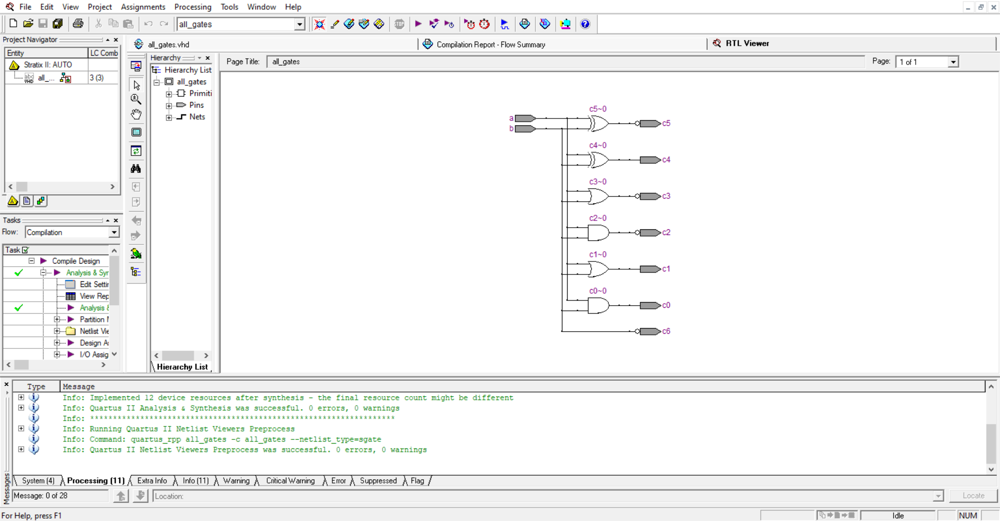
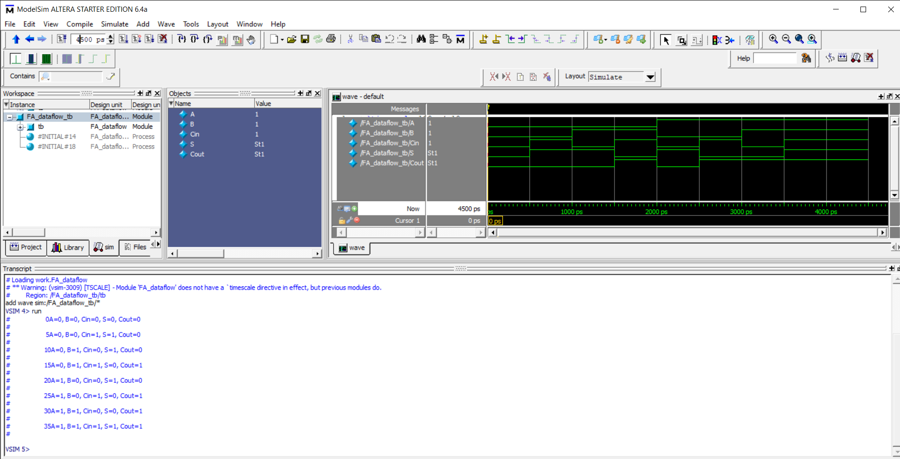

# VHDL- Verilog Coding

This repository contains various VHDL/Verilog programs for digital circuits. Feel free to raise issue or contact the contributors in case of any doubts or development of this repository.

## VHDL Introduction
VHDL stands for very-high-speed integrated circuit hardware description language. It's a programming language that lets you model a digital system using dataflow, behavioural, and structural modelling techniques. VHDL is a programming language that is commonly used to create text models of logic circuits. The logic design is tested using simulation software that uses simulation models to represent the interface's logic circuits. The logic design is tested using a simulation programme that uses simulation models to represent the logic circuits that interact with the design. The main benefit of VHDL is that it allows the behaviour of the necessary device to be represented and tested before the design is translated into real hardware by synthesis tools.
Quartus II 9.0 Software has been used for VHDL coding. The example RTL view in Quartus is shown below

## Verilog Introduction
Verilog is a Hardware Description Language developed to simplify the process of implementing Hardware designs on software by describing the functionality of desired hardware using codes. Unlike VHDL, which is quite verbose and has strict datatype checking, Verilog is a more compact and flexibel language. Thus today Verilog is the most popular Hardware Description Language used for hardware circuit implementations on a computer.
Modelsim- Altera 6.4a Software has been used for Verilog coding. The example simulation in Modelsim is shown below

## Download links
* [Quartus II 9.0](https://fpgasoftware.intel.com/13.0sp1/?edition=web)
* [Modelsim- Altera 6.4a](https://drive.google.com/uc?id=1bRwvnQrGw0gavGml-SpD0AZFAumdPXTg&export=download)
